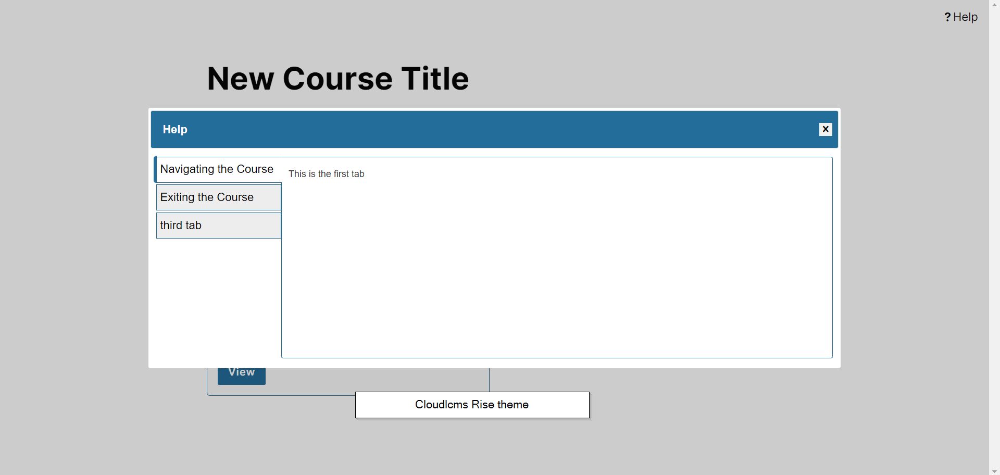
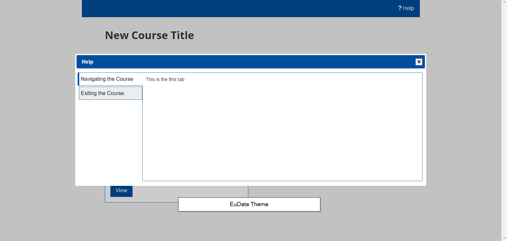
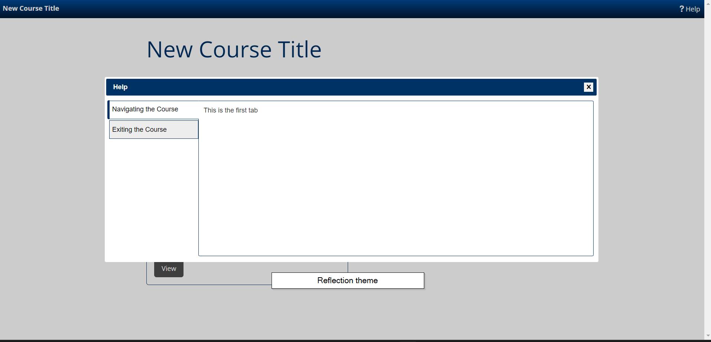
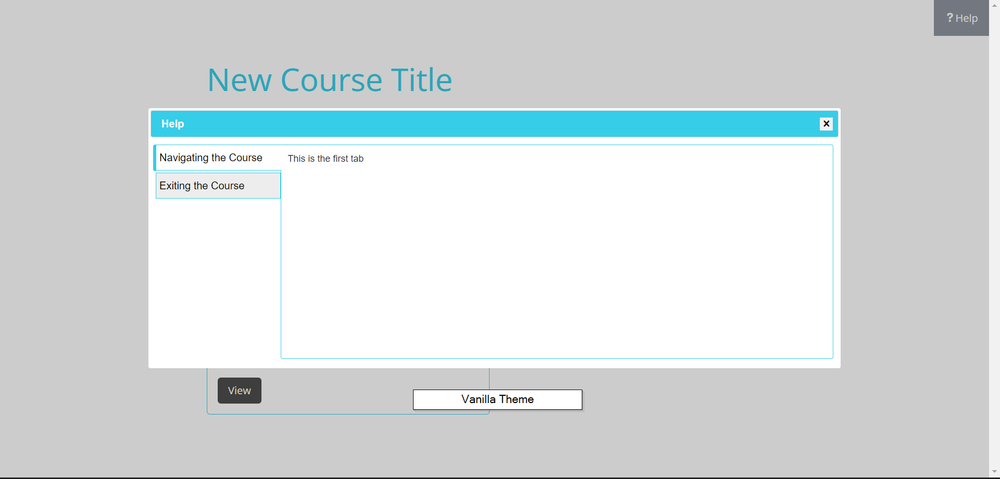

# Help-Dialog Extension

This repository contains a collection of screenshots showcasing a help-dialog extension with various themes for [Cloudlcms](https://dev.cloudlcms.com/). The extension is designed to provide users with valuable information and guidance on different topics within the Cloudlcms platform.

## Screenshots

### Rise Theme

_Description: Screenshot demonstrating the Rise Theme._

### EuData Theme

_Description: Screenshot demonstrating the EuData Theme._

### Reflection Theme

_Description: Screenshot demonstrating the Reflection Theme._

### Vanilla Theme

_Description: Screenshot demonstrating the Vanilla Theme._

